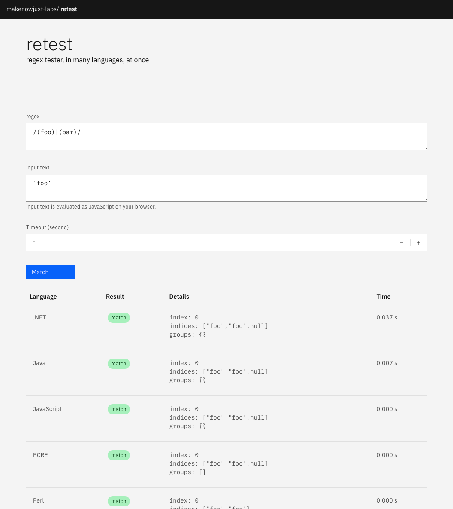

# retest



## Prerequisite

- .NET SDK (`dotnet`)
- JDK (`java`)
- Node.js (`node` and `npm`)
- PHP (`php`)
- Python 3 (`python3`)
- Perl (`perl`)
- Ruby (`ruby`)

## Setup

- Build .NET tester.

  ```console
  $ pushd testers/dotnet
  $ dotnet build --conofiguration=Release
  $ popd
  ```

- Build Java tester.

  ```console
  $ pushd testers/java
  $ ./gradlew installDist
  $ popd
  ```

- Run frontend.

  ```console
  $ npm run dev -- --open
  ```

## License

MIT

(C) 2022 TSUYUSATO "[MakeNowJust](https://github.com/makenowjust)" Kitsune
